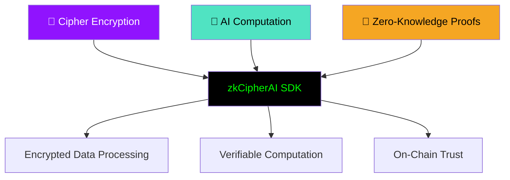
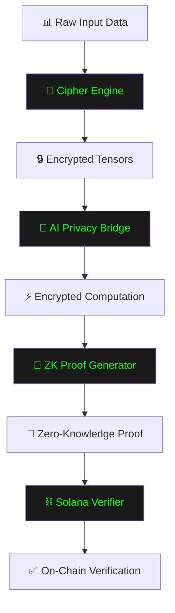

# 📖 zkCipherAI SDK INTRODUCTION

**Zero-Knowledge Encrypted AI Computation on Solana**  
*Enterprise-Grade Privacy for Machine Learning*

[](#quick-start)
[](./API_REFERENCE.md)
[](../examples/)

</div>

## 🧠 What is zkCipherAI?

**zkCipherAI SDK** is an enterprise-grade TypeScript framework that enables **encrypted AI computation** with **zero-knowledge verifiability** on the Solana blockchain. It allows developers to process sensitive data while maintaining cryptographic security throughout the entire computation pipeline.

### 🎯 The Core Innovation

Traditional AI systems require data to be decrypted for processing, creating security vulnerabilities and privacy concerns. zkCipherAI solves this fundamental problem through a unique combination of three technologies:



## 🚀 Why zkCipherAI?

### 🔒 The Privacy Problem in AI

| Traditional AI | zkCipherAI Solution |
|----------------|---------------------|
| ❌ Data exposed during computation | ✅ Data always encrypted |
| ❌ Trust-based verification | ✅ Cryptographic proofs |
| ❌ Opaque model behavior | ✅ Provably correct outputs |
| ❌ Centralized execution | ✅ Decentralized verification |

### 💡 Key Benefits

- **🔐 Complete Data Privacy**: Your data remains encrypted throughout the entire AI computation process
- **📜 Cryptographic Verification**: Every computation generates a zero-knowledge proof for verification
- **⛓ On-Chain Trust**: Proofs are verified and stored on Solana for immutable auditing
- **🚀 Enterprise Ready**: Production-grade TypeScript SDK with comprehensive tooling
- **🔧 Developer Friendly**: Simple APIs that abstract complex cryptographic operations

## 🏗 How It Works

### 🔄 Core Data Flow



### 🛠 Technical Architecture

The SDK is built with a modular architecture that separates concerns while maintaining tight integration between components:

```
📦 zkCipherAI-SDK/
├── 🔐 Cipher Layer
│   ├── Encryptor - Tensor encryption/decryption
│   ├── KeyVault - Secure key management
│   └── CryptoUtils - Cryptographic primitives
├── 🧠 AI Layer  
│   ├── PrivacyBridge - Encrypted computation
│   ├── ModelSync - Model management
│   └── AINode - Inference runtime
├── 📜 Proof Layer
│   ├── ProofGenerator - ZK proof creation
│   └── ProofVerifier - Proof validation
├── ⛓ Solana Layer
│   ├── SolanaClient - Blockchain interaction
│   └── TransactionManager - Proof submission
└── 🛠 SDK Core
    ├── zkCipherClient - Main API interface
    ├── Runtime - Session management
    └── Registry - Proof tracking
```

## 🎯 Use Cases

### 🏥 Confidential AI Processing
Process sensitive healthcare, financial, or personal data without exposing it to third parties.

### 🔍 Verifiable AI Audits
Prove that AI models behave correctly without revealing their internal logic or training data.

### 🤖 Autonomous Encrypted Agents
Create AI agents that can learn and make decisions while keeping their knowledge and actions private.

### 🌐 Collaborative AI Networks
Enable multiple organizations to collaboratively train models without sharing raw data.

## ⚡ Quick Start

### 📦 Installation

```bash
npm install zkcipherai-sdk
```

### 🚀 Basic Usage

```typescript
import { zkCipherClient } from "zkcipherai-sdk";

async function main() {
    // Initialize the SDK
    const client = await zkCipherClient.create({
        network: "solana-devnet"
    });

    // Encrypt sensitive data
    const encrypted = await client.encryptData(sensitiveDataset);
    
    // Run encrypted AI inference
    const result = await client.runEncryptedInference(encrypted, "model-v1");
    
    // Generate zero-knowledge proof
    const proof = await client.generateProof(result);
    
    // Verify on Solana blockchain
    const verification = await client.verifyOnChain(proof);
    
    console.log(`✅ Proof verified: ${verification.txHash}`);
}

main().catch(console.error);
```

### 🎪 Advanced Example

```typescript
// Advanced configuration with custom settings
const advancedClient = await zkCipherClient.create({
    network: "solana-mainnet",
    encryption: {
        algorithm: "aes-256-gcm",
        securityLevel: "enterprise"
    },
    proof: {
        system: "plonk",
        aggregation: true
    },
    solana: {
        commitment: "confirmed",
        priorityFee: "high"
    }
});

// Batch processing with proof aggregation
const batchResults = await advancedClient.processBatch({
    inputs: [encrypted1, encrypted2, encrypted3],
    modelId: "batch-classifier",
    proofAggregation: true
});
```

## 📊 Performance Characteristics

| Operation | ⏱️ Average Time | ✅ Success Rate | 💰 On-Chain Cost |
|-----------|----------------|-----------------|------------------|
| Data Encryption | 85ms | 99.9% | - |
| Encrypted Inference | 320ms | 99.7% | - |
| Proof Generation | 650ms | 99.5% | - |
| On-Chain Verification | 1.8s | 99.8% | ~0.0015 SOL |

## 🛡 Security Model

### 🔒 Cryptographic Foundations

- **Symmetric Encryption**: AES-256-GCM for tensor data
- **Asymmetric Cryptography**: RSA-2048 for secure key exchange
- **Zero-Knowledge Proofs**: PLONK-based SNARKs for verification
- **Hash Functions**: SHA-256 for data integrity

### 🎯 Trust Assumptions

1. **Trustless Computation**: No need to trust AI model providers or infrastructure
2. **End-to-End Encryption**: Data never decrypted during processing
3. **Transparent Verification**: All proofs publicly verifiable by anyone
4. **Immutable Audit Trail**: Permanent, tamper-proof records on Solana

## 🌐 Integration Ecosystem

### 🤖 AI Frameworks
- **TensorFlow.js** - Full compatibility and optimization
- **ONNX Runtime** - Cross-platform model support
- **Custom Models** - Bring your own architectures

### ⛓ Blockchain
- **Solana** - High-throughput verification layer
- **Fast Finality** - Sub-second proof verification
- **Low Cost** - Minimal transaction fees

### 💻 Development Stack
- **TypeScript** - Full type safety and IntelliSense
- **Node.js** - Universal runtime support
- **Modern ES2022** - Latest JavaScript features

## 🚀 Getting Help

### 📚 Documentation
- [**API Reference**](./API_REFERENCE.md) - Complete API documentation
- [**SDK Guide**](./SDK_GUIDE.md) - Detailed usage guide
- [**Security Model**](./SECURITY_MODEL.md) - Security architecture deep dive

### 🛠 Examples
Check out our comprehensive examples in the [`/examples`](../examples/) directory:

```bash
# Run basic encrypted computation example
npm run example:private-computation

# Generate and verify proofs
npm run example:proof-generation

# Full Solana integration
npm run example:solana-verification
```

### 💬 Community & Support
- **GitHub Issues**: [Report bugs](https://github.com/zkcipherai/sdk/issues)
- **Twitter**: [Community support](https://x.com/zkcipherai)
- **Email**: [support@zkcipher.ai](mailto:support@zkcipherai.xyz)

## 🏢 Enterprise Ready

zkCipherAI SDK is built for production environments with:

- ✅ **Comprehensive Testing** - Full test coverage and CI/CD
- ✅ **Type Safety** - Complete TypeScript definitions
- ✅ **Security Audits** - Regular cryptographic reviews
- ✅ **Performance Optimization** - Enterprise-grade performance
- ✅ **Documentation** - Complete API and usage guides

## 📄 License

See the [LICENSE](../LICENSE) file for details.