# 🛡 zkCipherAI SECURITY MODEL

**Comprehensive Security Framework for Private AI Computation**  
*Military-Grade Cryptography meets Zero-Knowledge Verification*

[](#-cryptographic-foundations)
[](#-trust-model)
[](#-threat-model)

## 🎯 Security Overview

zkCipherAI implements a multi-layered security architecture that combines cutting-edge cryptography with blockchain-based verification to create a trustless environment for private AI computation.

### Security Principles

```mermaid
graph TD
    A[🔐 Data Confidentiality] --> E[End-to-End Security]
    B[📜 Computation Integrity] --> E
    C[⛓ Verifiable Trust] --> E
    D[🔍 Transparent Auditing] --> E
    
    style A fill:#9013fe,color:white
    style B fill:#50e3c2,color:black
    style C fill:#f5a623,color:black
    style D fill:#14f195,color:black
    style E fill:#000000,color:#00ff00
```



## 🔐 Cryptographic Foundations

### Encryption Stack

#### 1. Symmetric Encryption (Data at Rest)

```typescript
// AES-256-GCM for tensor encryption
interface AES256GCMConfig {
  algorithm: "AES-GCM"
  keyLength: 256 // bits
  tagLength: 128 // bits
  ivLength: 96   // bits
  additionalData?: Uint8Array
}

// Key derivation using HKDF
class KeyDerivation {
  static deriveFromMaster(
    masterKey: CryptoKey,
    context: string,
    length: number = 32
  ): Promise<CryptoKey>
}
```

**Security Properties:**
- ✅ **Confidentiality**: AES-256 provides 256-bit security
- ✅ **Integrity**: GCM mode provides authentication
- ✅ **Nonce Misuse Resistance**: 96-bit IVs prevent nonce reuse attacks

#### 2. Asymmetric Cryptography (Key Exchange)

```typescript
// RSA-2048 for secure key distribution
interface RSAConfig {
  modulusLength: 2048
  publicExponent: new Uint8Array([0x01, 0x00, 0x01])
  hash: "SHA-256"
}

// Elliptic Curve for signatures
interface ECCConfig {
  curve: "P-256"
  hash: "SHA-256"
  namedCurve: "P-256"
}
```

#### 3. Zero-Knowledge Proof System

```typescript
// PLONK-based SNARK configuration
interface ZKConfig {
  proofSystem: "plonk"
  curve: "bn254"
  securityLevel: 128 // bits
  trustedSetup: "perpetual powers of tau"
  circuitSize: 2^20 // gates
}

// Proof generation parameters
interface ProofParams {
  complexity: "low" | "medium" | "high"
  aggregation: boolean
  recursive: boolean
  optimization: "speed" | "size"
}
```

### Cryptographic Protocols

#### 1. Hybrid Encryption Protocol

```
Client Side:
1. Generate ephemeral key pair (EK_priv, EK_pub)
2. Derive symmetric key: K = KDF(ECDH(EK_priv, Server_pub))
3. Encrypt data: CT = AES-256-GCM(K, data)
4. Transmit: (EK_pub, CT, Auth Tag)

Server Side:
1. Derive symmetric key: K = KDF(ECDH(Server_priv, EK_pub))
2. Decrypt and verify: data = AES-256-GCM(K, CT)
```

#### 2. Zero-Knowledge Proof Protocol

```
Computation Proof:
1. Compute arithmetic circuit C from computation
2. Generate proving key PK and verification key VK
3. Create witness W from input/output
4. Generate proof π = Prove(PK, C, W)
5. Verify: Verify(VK, C, π) → true/false
```

## 🤝 Trust Model

### Trust Assumptions

#### 1. Trustless Computation

```typescript
// No trust required in computation providers
interface TrustAssumptions {
  trustAIProvider: false
  trustInfrastructure: false
  trustHardware: false
  trustNetwork: false
}

// All trust is cryptographic
interface CryptographicTrust {
  trustMath: true
  trustCryptography: true
  trustBlockchain: true
}
```

#### 2. Trust Boundaries

```mermaid
graph LR
    A[🔒 User Data] --> B[zkCipherAI SDK]
    B --> C[📜 ZK Proofs]
    C --> D[⛓ Solana Blockchain]
    
    E[🤖 AI Models] --> B
    F[🖥 Computation] --> B
    
    style A fill:#9013fe,color:white
    style D fill:#14f195,color:black
```



### Trust Verification Points

```typescript
class TrustVerifier {
  // Verify cryptographic primitives
  static verifyEncryption(encrypted: EncryptedData): Promise<VerificationResult>
  
  // Verify proof correctness
  static verifyProofIntegrity(proof: ZKProof): Promise<IntegrityResult>
  
  // Verify blockchain state
  static verifyOnChainState(verification: OnChainVerification): Promise<StateResult>
  
  // Verify model integrity
  static verifyModelHash(model: EncryptedModel, expectedHash: string): Promise<HashResult>
}
```

## 🎯 Threat Model

### Identified Threats

#### 1. Data Exposure Threats

| Threat | Risk Level | Mitigation |
|--------|------------|------------|
| Eavesdropping on network | 🟡 Medium | End-to-end encryption |
| Memory scraping | 🟠 High | Secure enclaves, memory encryption |
| Storage compromise | 🟡 Medium | Encrypted storage, key rotation |
| Side-channel attacks | 🟠 High | Constant-time operations |

#### 2. Computation Threats

| Threat | Risk Level | Mitigation |
|--------|------------|------------|
| Model tampering | 🟢 Low | Cryptographic hashing, digital signatures |
| Input manipulation | 🟡 Medium | Input validation, proof verification |
| Output forgery | 🟢 Low | ZK proof verification |
| Computational errors | 🟡 Medium | Proof generation, multiple validations |

#### 3. System Threats

| Threat | Risk Level | Mitigation |
|--------|------------|------------|
| Key compromise | 🟠 High | Key rotation, secure storage |
| API abuse | 🟡 Medium | Rate limiting, authentication |
| Denial of Service | 🟡 Medium | Resource limits, circuit breaking |

### Attack Vectors

#### 1. Cryptographic Attacks

```typescript
// Protection against common attacks
interface CryptographicProtections {
  timingAttacks: "constant-time operations"
  powerAnalysis: "blinding techniques"
  faultInjection: "error detection"
  quantumAttacks: "post-quantum readiness"
}

// Key protection measures
interface KeyProtection {
  storage: "hardware security modules"
  transmission: "secure channels"
  lifecycle: "automatic rotation"
  backup: "encrypted, distributed"
}
```

#### 2. System-Level Attacks

```typescript
// Runtime protection
interface RuntimeSecurity {
  memoryProtection: "ASLR, DEP"
  codeIntegrity: "digital signatures"
  sandboxing: "process isolation"
  monitoring: "real-time detection"
}

// Network security
interface NetworkSecurity {
  transport: "TLS 1.3"
  authentication: "mutual TLS"
  encryption: "end-to-end"
  validation: "certificate pinning"
}
```

## 🛡 Security Guarantees

### 1. Data Confidentiality

**Guarantee:** Data remains encrypted throughout computation

```typescript
// Confidentiality proof
interface ConfidentialityProof {
  encryptionStrength: "AES-256" // 2^128 security
  keySecurity: "256-bit keys"
  algorithmSecurity: "provably secure"
  implementation: "verified crypto"
}

// Leakage prevention
interface LeakagePrevention {
  memory: "zeroization after use"
  storage: "encrypted at rest"
  transmission: "encrypted in transit"
  logs: "no sensitive data"
}
```

### 2. Computation Integrity

**Guarantee:** All computations are provably correct

```typescript
// Integrity verification
interface IntegrityVerification {
  proofSystem: "PLONK SNARKs"
  securityLevel: "128 bits"
  soundnessError: "negligible"
  completeness: "perfect"
}

// Tamper evidence
interface TamperEvidence {
  inputHash: "cryptographic binding"
  outputHash: "verifiable linkage"
  computationTrace: "complete audit"
  blockchainRecord: "immutable"
}
```

### 3. Verifiable Trust

**Guarantee:** Trust established through cryptographic proofs

```typescript
// Trust verification chain
interface TrustChain {
  dataOrigin: "cryptographic signatures"
  computation: "zero-knowledge proofs"
  verification: "on-chain records"
  audit: "public verifiability"
}

// Trust metrics
interface TrustMetrics {
  cryptographicSecurity: "256-bit"
  proofSoundness: "2^-128"
  blockchainSecurity: "Solana consensus"
  implementationSecurity: "audited"
}
```

## 🔧 Security Implementation

### Secure Development Practices

#### 1. Code Security

```typescript
// Secure coding standards
interface SecureCoding {
  language: "TypeScript with strict mode"
  memorySafety: "automatic memory management"
  typeSafety: "compile-time verification"
  dependencySecurity: "regular audits"
}

// Security testing
interface SecurityTesting {
  staticAnalysis: "SAST tools"
  dynamicAnalysis: "DAST tools"
  fuzzTesting: "input validation"
  penetrationTesting: "regular assessments"
}
```

#### 2. Cryptographic Implementation

```typescript
// Crypto implementation security
interface CryptoSecurity {
  libraries: "verified implementations"
  randomNumberGeneration: "CSPRNG"
  keyManagement: "hardware-backed"
  sideChannelProtection: "constant-time"
}

// Implementation verification
interface ImplementationVerification {
  algorithmSpecification: "formal verification"
  codeReview: "multiple reviewers"
  securityAudit: "third-party audits"
  bugBounty: "public program"
}
```

### Key Management Security

#### 1. Key Lifecycle

```typescript
class SecureKeyManager {
  // Key generation
  async generateSecureKey(): Promise<CryptoKey> {
    // Using cryptographically secure random
    return crypto.subtle.generateKey(...)
  }
  
  // Key storage
  async storeKeySecurely(key: CryptoKey): Promise<string> {
    // Encrypted storage with access controls
  }
  
  // Key rotation
  async rotateKeys(): Promise<RotationResult> {
    // Automatic rotation with grace period
  }
  
  // Key destruction
  async destroyKey(keyId: string): Promise<void> {
    // Secure deletion with verification
  }
}
```

#### 2. Key Protection

```typescript
// Multi-layered key protection
interface KeyProtectionLayers {
  layer1: "hardware security modules"
  layer2: "encrypted key stores"
  layer3: "access control policies"
  layer4: "audit logging"
  layer5: "intrusion detection"
}

// Key usage policies
interface KeyUsagePolicies {
  encryptionKeys: "session-based"
  signingKeys: "device-bound"
  masterKeys: "hardware-protected"
  backupKeys: "distributed, encrypted"
}
```

## 📜 Security Best Practices

### For Developers

#### 1. Secure Configuration

```typescript
// Recommended security configuration
const secureConfig: ClientConfig = {
  network: "solana-mainnet",
  encryption: {
    algorithm: "aes-256-gcm",
    keyRotation: "auto",
    securityLevel: "enterprise"
  },
  proof: {
    system: "plonk",
    aggregation: true,
    securityBits: 128
  },
  security: {
    auditLogging: true,
    intrusionDetection: true,
    automaticUpdates: true
  }
}
```

#### 2. Secure Usage Patterns

```typescript
// Secure data handling
class SecureDataProcessor {
  async processSensitiveData(data: SensitiveData) {
    // 1. Validate input
    this.validateInput(data);
    
    // 2. Encrypt immediately
    const encrypted = await this.encryptData(data);
    
    // 3. Process encrypted
    const result = await this.processEncrypted(encrypted);
    
    // 4. Generate proof
    const proof = await this.generateProof(result);
    
    // 5. Verify on-chain
    await this.verifyOnChain(proof);
    
    // 6. Clean up sensitive data
    this.secureCleanup(data);
  }
}
```

#### 3. Error Handling Security

```typescript
// Secure error handling
class SecureErrorHandler {
  static handleError(error: Error) {
    // Don't expose internal details
    if (error instanceof CryptographicError) {
      console.error("Cryptographic operation failed");
      // Log internally for debugging
      this.internalLog(error);
    } else {
      console.error("Operation failed");
    }
    
    // Clean up sensitive state
    this.cleanupSensitiveState();
  }
}
```

### For System Administrators

#### 1. Infrastructure Security

```yaml
# Security hardening checklist
security_hardening:
  network_security:
    - firewall_rules: "restrict inbound traffic"
    - vpn_access: "required for administration"
    - intrusion_detection: "enabled"
  
  system_security:
    - automatic_updates: "enabled"
    - security_patches: "applied within 24h"
    - access_controls: "principle of least privilege"
  
  monitoring:
    - security_logs: "centralized collection"
    - anomaly_detection: "real-time"
    - alerting: "24/7 coverage"
```

#### 2. Key Management

```bash
# Production key management procedures
# 1. Use HSM for master keys
# 2. Implement key rotation policies
# 3. Monitor key usage patterns
# 4. Maintain secure backups
```

## 🔍 Security Monitoring & Auditing

### Real-time Monitoring

```typescript
interface SecurityMonitor {
  // Threat detection
  detectAnomalies(metrics: SecurityMetrics): Promise<ThreatDetection>
  
  // Compliance monitoring
  checkCompliance(policies: SecurityPolicy[]): Promise<ComplianceReport>
  
  // Incident response
  handleSecurityIncident(incident: SecurityIncident): Promise<IncidentResponse>
}

// Security metrics collection
interface SecurityMetrics {
  encryptionOperations: number
  proofGenerations: number
  failedVerifications: number
  keyRotations: number
  securityEvents: SecurityEvent[]
}
```

### Security Auditing

```typescript
// Comprehensive audit trail
interface AuditTrail {
  cryptographicOperations: CryptoAuditRecord[]
  proofGenerations: ProofAuditRecord[]
  blockchainInteractions: BlockchainAuditRecord[]
  systemEvents: SystemAuditRecord[]
}

// Audit verification
class SecurityAuditor {
  static verifyAuditTrail(trail: AuditTrail): Promise<AuditVerification>
  static generateComplianceReport(trail: AuditTrail): Promise<ComplianceReport>
  static detectSecurityGaps(config: SecurityConfig): Promise<SecurityGap[]>
}
```

## 🚨 Incident Response

### Security Incident Classification

| Severity | Response Time | Actions |
|----------|---------------|---------|
| 🔴 Critical | < 1 hour | Immediate service suspension, forensic analysis |
| 🟠 High | < 4 hours | Partial service suspension, investigation |
| 🟡 Medium | < 24 hours | Enhanced monitoring, patch deployment |
| 🟢 Low | < 72 hours | Routine investigation, documentation |

### Incident Response Plan

```typescript
class SecurityIncidentResponse {
  async handleIncident(incident: SecurityIncident) {
    // 1. Triage and classification
    const severity = await this.classifyIncident(incident);
    
    // 2. Containment
    await this.containIncident(incident);
    
    // 3. Investigation
    const rootCause = await this.investigateIncident(incident);
    
    // 4. Eradication
    await this.eradicateThreat(rootCause);
    
    // 5. Recovery
    await this.recoverServices();
    
    // 6. Lessons learned
    await this.documentLessons(incident);
  }
}
```

---