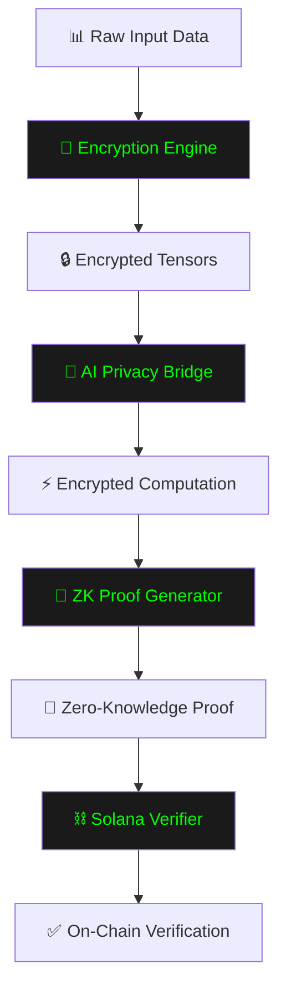
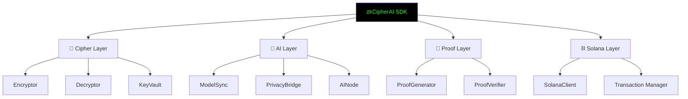

# 🔐 zkCipherAI SDK

> **Enterprise-Grade Confidential AI Computation with Zero-Knowledge Verifiability**  
> *Privacy-Preserving Machine Learning on Solana*


[](https://solana.com)
[](https://www.typescriptlang.org/)
[](LICENSE)
[](https://nodejs.org/)

## 🧠 Overview

**zkCipherAI** is a privacy-first intelligence protocol combining **Zero-Knowledge Proofs, Cipher encryption, and AI computation** to enable verifiable machine learning on Solana — without exposing any data.
The **zkCipherAI SDK** provides developers with a seamless framework to **encrypt, compute, and verify** AI operations securely.
It transforms ordinary computation into **cryptographically proven intelligence**, ensuring privacy and trust at every step.

> **Compute privately. Prove publicly.**

With zkCipherAI, intelligence evolves under encryption — bringing cryptographic assurance to the future of AI.

**Visit our platform:** [www.zkcipherai.xyz](https://www.zkcipherai.xyz)


---

## 📋 Table of Contents

- 🏗️ [Architecture Overview](#-architecture-overview)
- ⚡ [Installation & Quick Start](#-installation--quick-start)
- 🔧 [Core Features](#-core-features)
- 📊 [Technical Specifications](#-technical-specifications)
- 🛠️ [Development Guide](#-development-guide)
- 📚 [API Reference](#-api-reference)
- 🛡️ [Security Model](#-security-model)
- 🤝 [Contributing](#-contributing)
- 📄 [License & Support](#-license--support)

---

## 🏗️ Architecture Overview

zkCipherAI SDK provides a comprehensive framework for executing AI computations on encrypted data while generating zero-knowledge proofs for verifiable correctness. The system ensures data remains encrypted throughout the entire computation pipeline.

### 🔄 Core Data Flow



### 🏛️ System Architecture



---

## ⚡ Installation & Quick Start

### 📋 Prerequisites

- 🟢 Node.js 18.0 or higher
- 🔷 TypeScript 5.0 or higher
- 💎 Solana CLI (optional, for advanced features)

### 📦 Installation

```bash
npm install zkcipherai-sdk
# or
yarn add zkcipherai-sdk
# or
pnpm add zkcipherai-sdk
```

### 🚀 Basic Usage Example

```typescript
import { zkCipherClient } from "zkcipherai-sdk";

async function runPrivateInference() {
    // 🎯 Initialize the SDK client
    const client = await zkCipherClient.create({
        network: "solana-mainnet",
        encryptionKey: process.env.ENCRYPTION_KEY,
        solanaRpcUrl: process.env.RPC_ENDPOINT
    });

    // 🔒 Load and encrypt sensitive data
    const sensitiveData = await client.loadTensor("financial_data.json");
    const encryptedData = await client.encryptData(sensitiveData);

    // 🧠 Execute encrypted AI inference
    const inferenceResult = await client.runEncryptedInference(
        encryptedData,
        {
            modelId: "confidential-classifier-v1",
            inputShape: [1, 256],
            outputClasses: 10
        }
    );

    // 📜 Generate zero-knowledge proof
    const zkProof = await client.generateProof(inferenceResult);

    // ⛓ Verify proof on Solana blockchain
    const verification = await client.verifyOnChain(zkProof);

    console.log(`✅ Inference completed and verified on-chain`);
    console.log(`📜 Proof Hash: ${zkProof.proofHash}`);
    console.log(`⛓ Transaction: ${verification.txHash}`);
}

runPrivateInference().catch(console.error);
```

### ⚙️ Advanced Configuration

```typescript
const advancedClient = await zkCipherClient.create({
    network: "solana-mainnet",
    encryption: {
        algorithm: "aes-256-gcm",
        keyRotation: "auto",
        securityLevel: "enterprise"
    },
    proof: {
        system: "plonk",
        aggregation: true,
        securityBits: 128
    },
    solana: {
        commitment: "confirmed",
        priorityFee: "high",
        maxRetries: 3
    }
});
```

---

## 🔧 Core Features

### 🔐 Military-Grade Encryption

```typescript
import { Encryptor, KeyVault } from "zkcipherai-sdk/cipher";

const encryptor = new Encryptor();
const keyVault = new KeyVault();

// 🔑 Generate encryption keys
const masterKey = await keyVault.generateMasterKey();
const sessionKey = await keyVault.deriveSessionKey(masterKey);

// 🎯 Encrypt tensor data
const tensorData = await loadTensorData();
const encryptedTensor = await encryptor.encryptTensor(tensorData, sessionKey);
const decryptedTensor = await encryptor.decryptTensor(encryptedTensor, sessionKey);
```

### 🧠 Encrypted AI Computation

```typescript
import { PrivacyBridge, ModelSync } from "zkcipherai-sdk/ai";

const privacyBridge = new PrivacyBridge();
const modelSync = new ModelSync();

// 🤖 Load and prepare AI model for encrypted computation
await modelSync.loadEncryptedModel("model-weights.enc");
const modelConfig = await modelSync.getModelConfiguration();

// ⚡ Execute inference on encrypted data
const encryptedResult = await privacyBridge.processEncrypted(
    encryptedTensor,
    modelConfig
);

// 📝 Generate computation trace for proof generation
const computationTrace = await privacyBridge.generateComputationTrace();
```

### 📜 Zero-Knowledge Proof System

```typescript
import { ProofGenerator, ProofVerifier } from "zkcipherai-sdk/proof";

const proofGenerator = new ProofGenerator();
const proofVerifier = new ProofVerifier();

// 🔏 Generate ZK proof for computation
const proof = await proofGenerator.createZKProof({
    computationTrace: computationTrace,
    inputHash: encryptedTensor.hash,
    outputHash: encryptedResult.hash,
    publicInputs: {
        modelId: modelConfig.modelId,
        timestamp: Date.now()
    }
});

// ✅ Verify proof locally before on-chain submission
const isValid = await proofVerifier.verifyProof(proof);
if (!isValid) {
    throw new Error("Proof verification failed");
}
```

### ⛓ Blockchain Integration

```typescript
import { SolanaClient } from "zkcipherai-sdk/solana";

const solanaClient = new SolanaClient({
    network: "mainnet-beta",
    commitment: "confirmed",
    timeout: 30000
});

// 🚀 Submit proof for on-chain verification
const transactionResult = await solanaClient.verifyProof(proof);

// 👀 Monitor transaction confirmation
const confirmation = await solanaClient.waitForConfirmation(
    transactionResult.txSignature
);

console.log(`✅ Proof verified in block: ${confirmation.slot}`);
```

---

## 📊 Technical Specifications

### ⚡ Performance Benchmarks

| Operation | ⏱️ Mean Time | 📈 95th Percentile | ✅ Success Rate |
|-----------|-----------|------------------|--------------|
| Tensor Encryption | 85ms | 120ms | 99.9% |
| Encrypted Inference | 320ms | 450ms | 99.7% |
| Proof Generation | 650ms | 850ms | 99.5% |
| On-Chain Verification | 1.8s | 2.5s | 99.8% |

### 💾 Resource Requirements

| Component | 🧠 Memory | 💻 CPU | 💾 Storage |
|-----------|---------|-----|---------|
| Cipher Engine | 128MB | Low | 50MB |
| AI Runtime | 512MB-2GB | Medium-High | 100MB-1GB |
| Proof System | 256MB-1GB | High | 200MB |
| Solana Client | 64MB | Low | 20MB |

### 🌐 Supported Platforms

- 🟢 **Node.js**: 18.x, 20.x
- 🖥️ **Operating Systems**: Linux, macOS, Windows
- 🏗️ **Architectures**: x64, ARM64
- 🤖 **AI Frameworks**: TensorFlow.js, ONNX Runtime
- ⛓️ **Blockchain**: Solana Mainnet, Devnet, Testnet

---

## 🛠️ SDK Structure

```
zkCipherAI-SDK/
├── src/
│   ├── 🔐 cipher/              # Encryption engine
│   │   ├── encryptor.ts     # Tensor encryption
│   │   ├── decryptor.ts     # Secure decryption
│   │   └── keyVault.ts      # Key management
│   ├── 🧠 ai/                  # AI integration layer
│   │   ├── modelSync.ts     # Model synchronization
│   │   ├── privacyBridge.ts # Encrypted computation
│   │   └── aiNode.ts        # Inference runtime
│   ├── 📜 proof/               # Zero-knowledge proofs
│   │   ├── generator.ts     # Proof generation
│   │   └── verifier.ts      # Proof validation
│   ├── ⛓ solana/              # Blockchain integration
│   │   ├── client.ts        # Solana RPC client
│   │   └── transaction.ts   # Transaction management
│   └── 🛠️ sdk/                 # Core SDK
│       ├── zkCipherClient.ts # Main client class
│       ├── runtime.ts       # Session management
│       └── registry.ts      # Proof registry
├── 🧪 tests/                   # Test suites
├── 📚 examples/                # Usage examples
└── 📖 docs/                    # Documentation
```

---

## 📚 API Reference

### 🎯 zkCipherClient

The main client class for interacting with the SDK.

```typescript
class zkCipherClient {
    static create(config: ClientConfig): Promise<zkCipherClient>;
    
    encryptData(data: TensorData): Promise<EncryptedData>;
    runEncryptedInference(data: EncryptedData, config: ModelConfig): Promise<InferenceResult>;
    generateProof(result: InferenceResult): Promise<ZKProof>;
    verifyOnChain(proof: ZKProof): Promise<VerificationResult>;
    
    getComputationMetrics(options: MetricsOptions): Promise<ComputationMetrics>;
    rotateEncryptionKeys(): Promise<void>;
    createSessionManager(): Promise<SessionManager>;
}
```

### 🔑 Key Classes and Interfaces

- 🗄️ **`EncryptedData`**: Container for encrypted tensor data
- 📜 **`ZKProof`**: Zero-knowledge proof structure
- 🧠 **`InferenceResult`**: Result of encrypted AI computation
- ✅ **`VerificationResult`**: On-chain verification result
- 📊 **`ComputationMetrics`**: Performance and reliability metrics

---

## 🛡️ Security Model

### 🔒 Cryptographic Foundations

- 🛡️ **Symmetric Encryption**: AES-256-GCM for tensor data
- 🔑 **Asymmetric Cryptography**: RSA-2048 for key exchange
- 🎭 **Zero-Knowledge Proofs**: PLONK-based SNARKs
- 🔗 **Hash Functions**: SHA-256 for data integrity

### 🤝 Trust Assumptions

1. 🔓 **Trustless Computation**: No need to trust AI model providers
2. 🔐 **End-to-End Encryption**: Data never decrypted during processing
3. 👁️ **Transparent Verification**: All proofs publicly verifiable
4. ⛓️ **Immutable Audit Trail**: Permanent record on Solana blockchain

### 🛡️ Security Best Practices

```typescript
// ✅ Always validate proofs before on-chain submission
const isValid = await proofVerifier.verifyProofLocally(proof);
if (!isValid) {
    throw new SecurityError("Local proof verification failed");
}

// 🔑 Use secure key management
const keyVault = new KeyVault();
await keyVault.initializeSecureStorage();
await keyVault.setupKeyRotation(7 * 24 * 60 * 60 * 1000); // Rotate weekly

// 👀 Monitor for suspicious activities
const securityMonitor = new SecurityMonitor();
securityMonitor.on('suspicious_activity', (event) => {
    console.warn(`🚨 Security alert: ${event.type}`);
});
```

---

## 🤝 Contributing

We welcome contributions from the community. Please see our [Contributing Guide](CONTRIBUTING.md) for detailed information.

### 🔄 Development Process

1. 🍴 Fork the repository
2. 🌿 Create a feature branch (`git checkout -b feature/amazing-feature`)
3. 💾 Commit changes (`git commit -m 'Add amazing feature'`)
4. 📤 Push to branch (`git push origin feature/amazing-feature`)
5. 🔔 Open a Pull Request

### 📝 Code Standards

- ✅ Follow TypeScript best practices
- 🧪 Include comprehensive tests
- 📖 Update documentation
- 🔄 Maintain backward compatibility
- 🔏 Sign commits with GPG

---

## 📄 License & Support

### 📜 License

This project is licensed under the Apache License 2.0 - see the [LICENSE](LICENSE) file for details.

### 🆘 Support

- 📚 **Website**: [www.zkcipherai.xyz](https://www.zkcipherai.xyz)
- 🐛 **GitHub**: [Report bugs](https://github.com/zkcipherai/)
- 📧 **Email**: [support@zkcipher.ai](mailto:support@zkcipher.ai)
- 💬 **Twitter**: [Community Support](https://x.com/zkcipher)

---
Built for a future where privacy isn’t an add-on — it’s the foundation of intelligence.

**zkCipherAI — Decrypt Nothing. Prove Everything.**